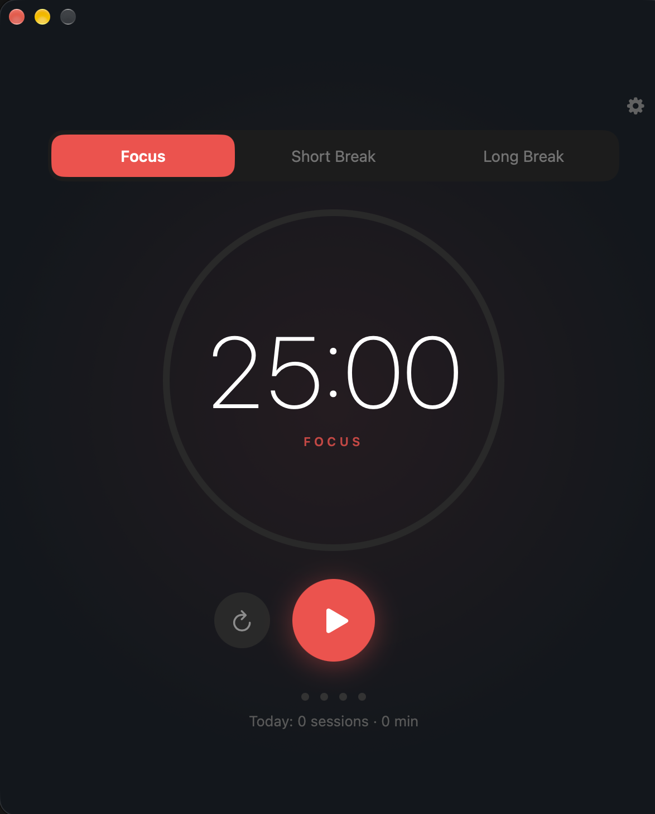
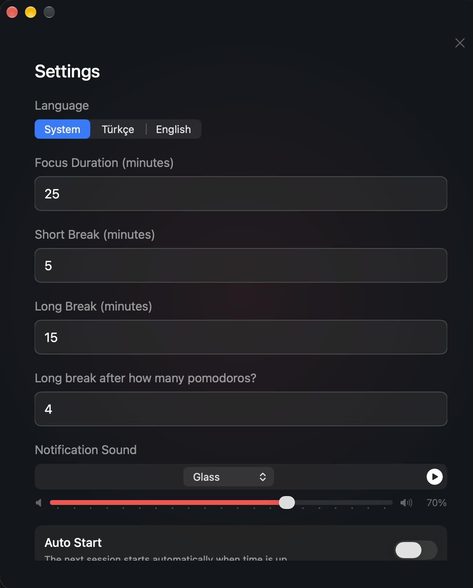

# Pomodoro for macOS

A lightweight Pomodoro timer that lives in the macOS menu bar, built with SwiftUI.
Available in **English** and **Turkish**.

**[Türkçe README](README.tr.md)**

<p>
  
  
</p>

## Download

1. Download **Pomodoro-1.0.zip** from the [latest release](https://github.com/mustafacicek-eee/pomodoro-macos/releases/latest).
2. Unzip it and move **Pomodoro.app** to your **Applications** folder.
3. Open it. The first time, macOS shows a warning that it can't verify the app. That's because the app isn't notarized by Apple. To allow it:
   1. Close the warning.
   2. Go to **System Settings → Privacy & Security**, scroll down to **Security**, and click **Open Anyway**. The button stays available for about an hour after you try to open the app.
   3. Enter your password.

   After that, the app opens normally ([Apple's guide](https://support.apple.com/guide/mac-help/open-a-mac-app-from-an-unknown-developer-mh40616/mac)).
4. Pomodoro runs in the menu bar and has no Dock icon. Look for the timer icon at the top of the screen.

The download needs a Mac with Apple silicon (M-series) and macOS 13 Ventura or later. You can also [build it yourself](#build).

## Features

- **Menu bar app.** There's no Dock icon. The remaining time shows in the menu bar, and the icon's color follows the mode (focus red, short break green, long break blue).
  - Left-click to show or hide the window.
  - Right-click for Start/Pause, Reset, Skip Break, About and Quit.
- **Durations.** Focus, short break and long break durations are adjustable (default 25 / 5 / 15 min), as is how many pomodoros come before a long break (default 4).
- **Auto start.** Optionally starts the next session as soon as the current one ends.
- **Extend (+5 min).** When a focus session ends, an extend option stays on screen for 30 seconds.
- **Sounds.**
  - Pick any system sound for notifications and set its volume.
  - Optional 2-minute warning before the end of a session.
  - Optional ticking sound during focus sessions.
- **Notifications.** macOS notifications when a session ends. Clicking one brings the window to the front.
- **Tracking.**
  - Daily session counters
  - Daily goal with a progress bar
  - Day streak 🔥
  - Last 7 days chart
- **Sleep and lock aware.** The timer pauses when the Mac sleeps or the screen locks.
- **Launch at login**, via `SMAppService`.
- **Single instance.** Opening the app a second time brings the existing window forward.
- **Two languages.** Follows your Mac's language by default. You can also switch between System / Türkçe / English in Settings, and the change applies instantly with no relaunch.

### Keyboard shortcuts

| Key | Action |
| --- | --- |
| `Space` | Start / pause |
| `R` | Reset |
| `⌘ ,` | Open / close settings |

## Requirements

- macOS 13 Ventura or later
- Xcode 16 or later, to build. The project uses file-system synchronized groups.

## Build

```bash
git clone https://github.com/mustafacicek-eee/pomodoro-macos.git
cd pomodoro-macos
open Pomodoro.xcodeproj
```

Press **⌘R** in Xcode. The project is set to *Sign to Run Locally*, so it builds without an Apple Developer account. To sign with your own team instead, select it under **Signing & Capabilities**. You can also change the **Bundle Identifier** there.

To build from the command line:

```bash
xcodebuild -project Pomodoro.xcodeproj -scheme Pomodoro -configuration Release build
```

The first time the app starts, macOS asks whether it may send notifications. If you decline, you can turn them on later in **System Settings → Notifications → Pomodoro**.

## Project structure

```
Pomodoro/
├── PomodoroApp.swift        # The whole app (model, timer, UI)
├── en.lproj/                # English strings
├── tr.lproj/                # Turkish strings
├── Assets.xcassets/         # App icon
└── Pomodoro.entitlements    # App Sandbox
Pomodoro.xcodeproj/
```

### Adding a language

1. Copy `Pomodoro/en.lproj` to `Pomodoro/<code>.lproj`, for example `de.lproj`, and translate the values.
2. In `PomodoroApp.swift`, add the code to `LanguageManager.supportedCodes` and add a case to `AppLanguage`. Then handle the new case in `AppLanguage.pickerLabel`, `LanguageManager.resolveCode(for:)` and `LanguageManager.locale`.
3. Add the code to `knownRegions` in the project.

## Privacy

The app runs in the App Sandbox with no network access. Settings and statistics are stored only on your Mac, in `UserDefaults`.

## Author

**Mustafa Çiçek**
[GitHub](https://github.com/mustafacicek-eee) · [LinkedIn](https://www.linkedin.com/in/mustafacicek-eee/)

## License

[MIT](LICENSE)
