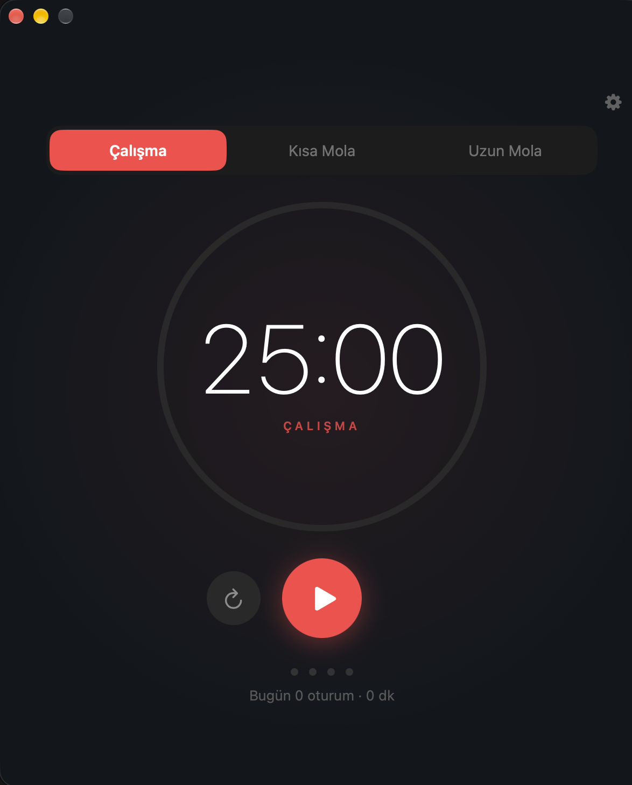
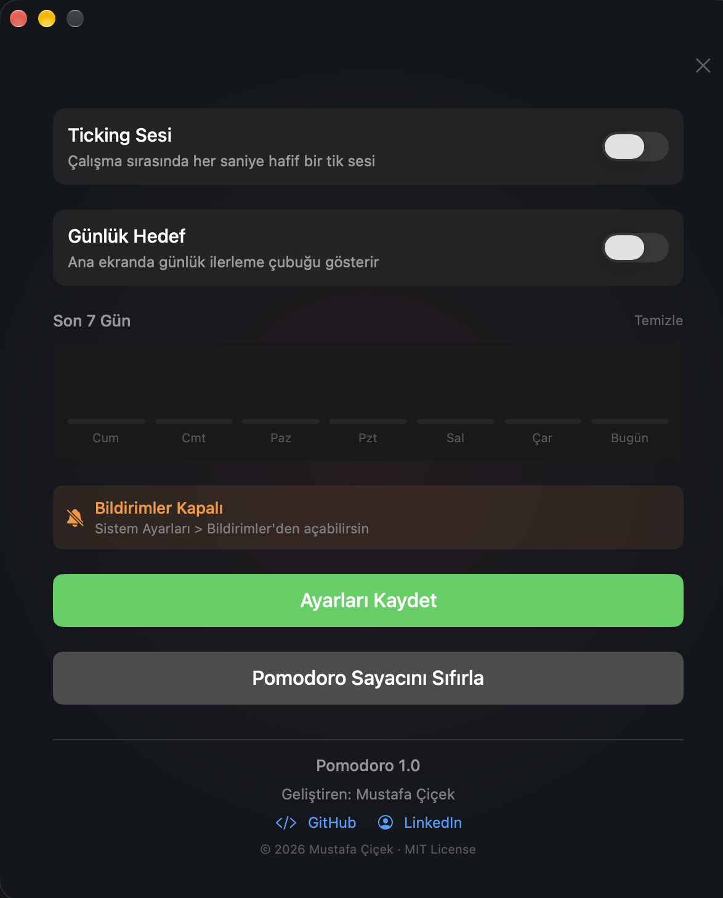

# Pomodoro (macOS)

macOS menü çubuğunda çalışan, SwiftUI ile yazılmış sade bir Pomodoro zamanlayıcısı.
**Türkçe** ve **İngilizce** dil desteği var.

**[English README](README.md)**

<p>
  
  
</p>

## İndir

1. [Son sürüm](https://github.com/mustafacicek-eee/pomodoro-macos/releases/latest) sayfasından **Pomodoro-1.0.zip** dosyasını indir.
2. Zip'i aç ve **Pomodoro.app**'i **Uygulamalar** klasörüne taşı.
3. Uygulamayı aç. İlk açılışta macOS uygulamayı doğrulayamadığını söyleyen bir uyarı gösterir. Bunun sebebi uygulamanın Apple'a onaylatılmamış (notarize edilmemiş) olması. İzin vermek için:
   1. Uyarıyı kapat.
   2. **Sistem Ayarları → Gizlilik ve Güvenlik** bölümüne git, aşağıdaki **Güvenlik** kısmına in ve **Yine de Aç**'a tıkla. Bu buton, uygulamayı açmayı denedikten sonra yaklaşık bir saat görünür kalır.
   3. Parolanı gir.

   Bundan sonra uygulama normal şekilde açılır ([Apple'ın rehberi](https://support.apple.com/tr-tr/guide/mac-help/mh40616/mac)).
4. Pomodoro menü çubuğunda çalışır, Dock'ta ikonu yoktur. Ekranın üstündeki zamanlayıcı ikonunu ara.

İndirilen sürüm Apple silicon (M serisi) işlemcili bir Mac ve macOS 13 Ventura veya üstünü gerektirir. Dilersen [kendin de derleyebilirsin](#derleme).

## Özellikler

- **Menü çubuğu uygulaması:** Dock ikonu yok. Kalan süre menü çubuğunda görünür ve ikonun rengi moda göre değişir (çalışma kırmızı, kısa mola yeşil, uzun mola mavi).
  - Sol tık pencereyi açar/kapatır.
  - Sağ tık menüsünde Başlat/Duraklat, Sıfırla, Molayı Atla, Hakkında ve Çıkış var.
- **Süreler:** Çalışma, kısa mola ve uzun mola süreleri ayarlanabilir (varsayılan 25 / 5 / 15 dk). Kaç pomodoroda bir uzun mola verileceği de ayarlanabilir (varsayılan 4).
- **Otomatik başlatma:** İstenirse süre bitince sonraki oturum kendiliğinden başlar.
- **Süre uzatma (+5 dk):** Çalışma süresi bitince 30 saniye boyunca uzatma seçeneği çıkar.
- **Sesler:**
  - Sistem seslerinden bildirim sesi seçilebilir, ses seviyesi ayarlanabilir.
  - İsteğe bağlı olarak süre bitmeden 2 dakika önce uyarı sesi çalar.
  - İsteğe bağlı olarak çalışma sırasında tik sesi açılabilir.
- **Bildirimler:** Oturum bitince macOS bildirimi gelir. Bildirime tıklayınca pencere öne gelir.
- **Takip:**
  - Günlük oturum sayaçları
  - Günlük hedef ve ilerleme çubuğu
  - Gün serisi 🔥
  - Son 7 günün grafiği
- **Uyku ve kilit:** Mac uyuduğunda ya da ekran kilitlendiğinde sayaç otomatik duraklar.
- **Açılışta başlat:** `SMAppService` ile oturum açılırken başlatılabilir.
- **Tek kopya:** Uygulama ikinci kez açılırsa mevcut pencere öne gelir.
- **İki dil:** Varsayılan olarak Mac'in dilini izler. Ayarlar'dan Sistem / Türkçe / English arasında geçiş de yapılabilir. Değişiklik yeniden başlatmadan anında uygulanır.

### Klavye kısayolları

| Tuş | İşlev |
| --- | --- |
| `Boşluk` | Başlat / duraklat |
| `R` | Sıfırla |
| `⌘ ,` | Ayarları aç / kapat |

## Gereksinimler

- macOS 13 Ventura veya üstü
- Derlemek için Xcode 16 veya üstü (proje dosya sistemiyle senkronize grupları kullanır)

## Derleme

```bash
git clone https://github.com/mustafacicek-eee/pomodoro-macos.git
cd pomodoro-macos
open Pomodoro.xcodeproj
```

Xcode'da **⌘R** ile çalıştır. Proje *Sign to Run Locally* (yerel imza) ile ayarlı olduğu için Apple Developer hesabı olmadan derlenir. Kendi geliştirici kimliğinle imzalamak istersen **Signing & Capabilities** sekmesinden kendi Team'ini seç. **Bundle Identifier**'ı da aynı yerden değiştirebilirsin.

Komut satırından derlemek için:

```bash
xcodebuild -project Pomodoro.xcodeproj -scheme Pomodoro -configuration Release build
```

Uygulama ilk açıldığında macOS bildirim izni ister. İzin vermezsen sonradan **Sistem Ayarları → Bildirimler → Pomodoro** yolundan açabilirsin.

## Proje yapısı

```
Pomodoro/
├── PomodoroApp.swift        # Uygulamanın tamamı (model, zamanlayıcı, arayüz)
├── en.lproj/                # İngilizce metinler
├── tr.lproj/                # Türkçe metinler
├── Assets.xcassets/         # Uygulama ikonu
└── Pomodoro.entitlements    # App Sandbox
Pomodoro.xcodeproj/
```

### Yeni dil eklemek

1. `Pomodoro/en.lproj` klasörünü `Pomodoro/<kod>.lproj` olarak kopyala (ör. `de.lproj`) ve metinleri çevir.
2. `PomodoroApp.swift` içinde kodu `LanguageManager.supportedCodes` listesine ekle ve `AppLanguage`'a bir case ekle. Yeni case'i `AppLanguage.pickerLabel`, `LanguageManager.resolveCode(for:)` ve `LanguageManager.locale` içinde de karşıla.
3. Kodu projedeki `knownRegions` listesine ekle.

## Gizlilik

Uygulama App Sandbox içinde çalışır ve ağ erişimi yoktur. Ayarlar ve istatistikler yalnızca Mac'inde, `UserDefaults` içinde tutulur.

## Geliştirici

**Mustafa Çiçek**
[GitHub](https://github.com/mustafacicek-eee) · [LinkedIn](https://www.linkedin.com/in/mustafacicek-eee/)

## Lisans

[MIT](LICENSE)
